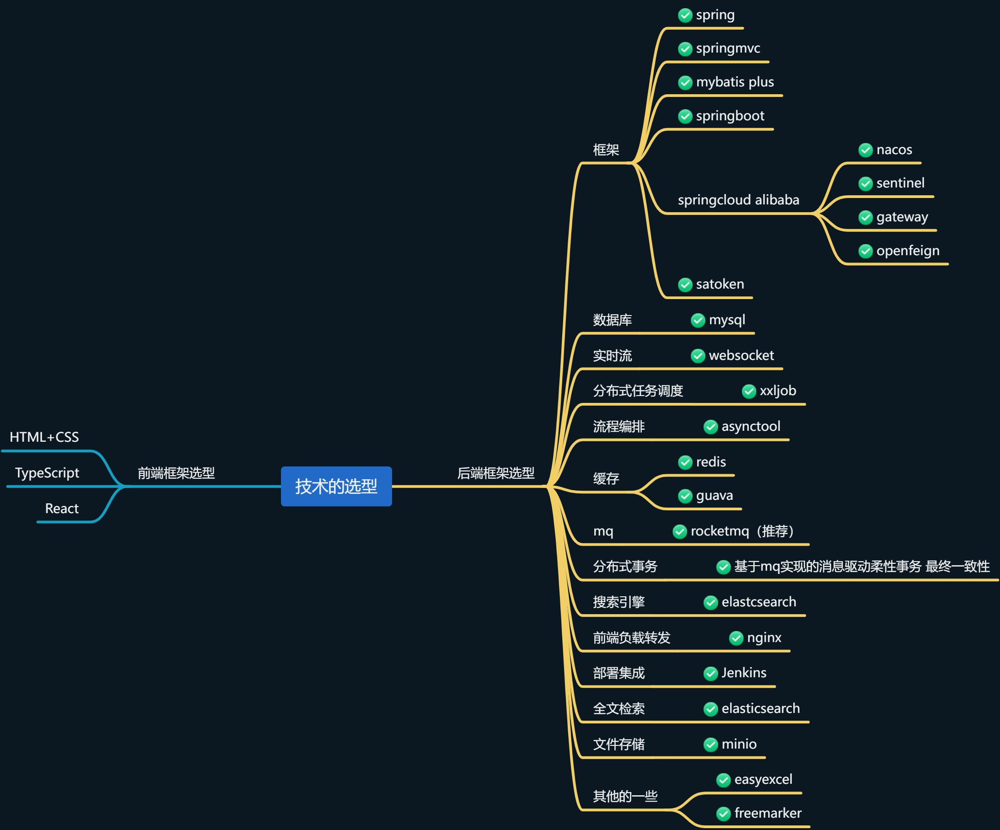
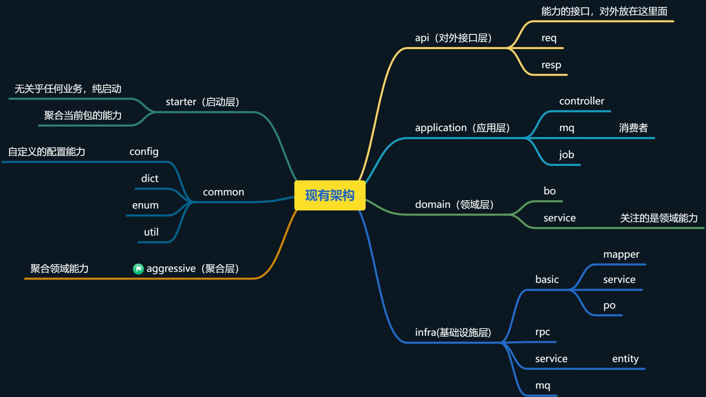
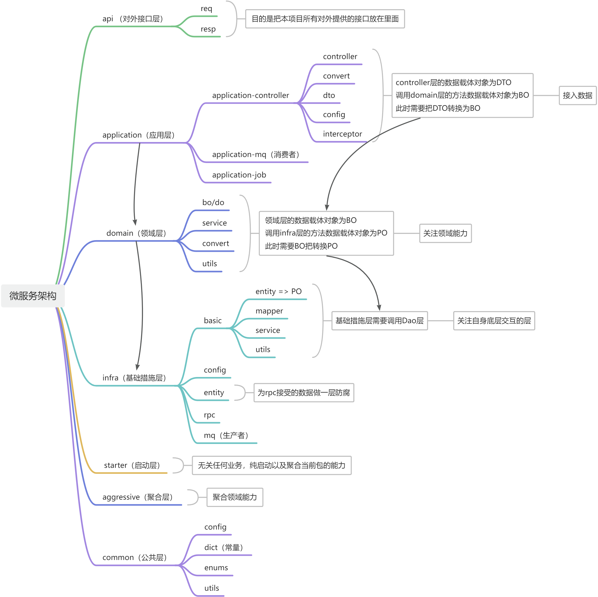
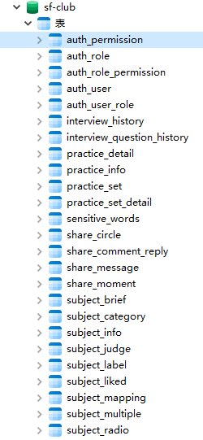

# 介绍
这是一款专为程序员设计的技术交流社区，采用主流微服务框架+C端技术栈做为技术架构。旨在帮助程序员消
除技术信息差，进行平台统一化，程序员可以在平台，完善自身知识，进行针对性面试题库练习，模拟面试，
来提升程序员面试能力。
## 项目简介
本项目是一个基于Spring Cloud Alibaba的微服务架构实践，采用了领域驱动设计（DDD）的分层思想，整合了当前主流的技术栈，包括Nacos、Satoken、RocketMQ等，旨在构建一个高可用、可扩展的分布式系统。
## 技术选型

## 现有架构
在复杂基础上简化保留精髓，一步步进行演变。

## 微服务架构

## 数据库设计

## 模块划分
 sf-club-auth            // 鉴权微服务 [3011]

 sf-club-gateway        // 网关微服务 [5000]	

 sf-club-subject        // 题目微服务 [3010]

 sf-club-circle         // 圈子微服务 [3014]

 sf-club-interview      // 面试微服务 [3015]

 sf-club-practice       // 练题微服务 [3013]

 sf-club-wechat         // 微信微服务 [3012]

 sf-club-oss            // oss微服务  [4000]
## 启动步骤
1. 克隆项目到本地：
   ```bash
   git clone [你的Gitee仓库地址]
   ```
2. 导入项目到IDE（如IntelliJ IDEA）中。
3. 安装Nacos并启动，然后在项目中配置Nacos地址（在`application.yml`中）。
4. 创建数据库，并执行SQL脚本初始化表结构（如果有的话）。
5. 修改各模块的配置文件（数据库连接、Redis连接等）。
6. 启动服务：从`starter`模块运行启动类。
